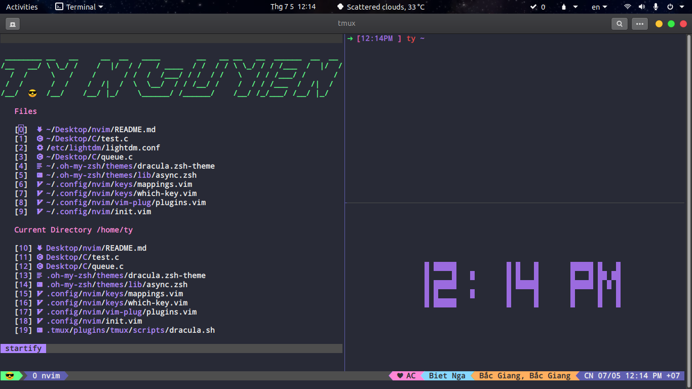

# My Nvim



## Install in one command

The following will install this config if you have an existing config it will move it to `~/.config/nvim.old`

This script only supports Mac, Ubuntu and Arch

```
bash <(curl -s https://raw.githubusercontent.com/TyNguyen2k1/My_Nvim/master/utils/install.sh)
```
## Chi la di coppy thoi :v
